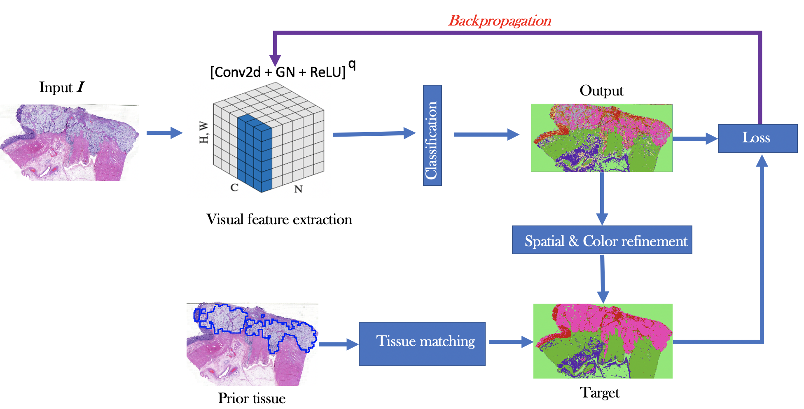
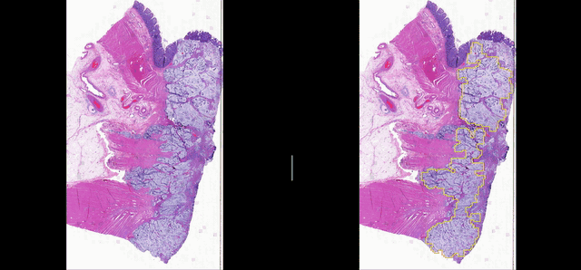

# Implementation: Deep learning for Group Affinity Unsupervised Segmentation 

## Method
</img>

## Requirements
- Python 3
- openslide
- NumPy 1.13.1
- Pytorch 1.6.0
- Sklearn: 0.18.1
- Matplotlib

   
## Run a test case

    $> python GAUS.py --slide <your mxsr file>

## Example of result

</img>

